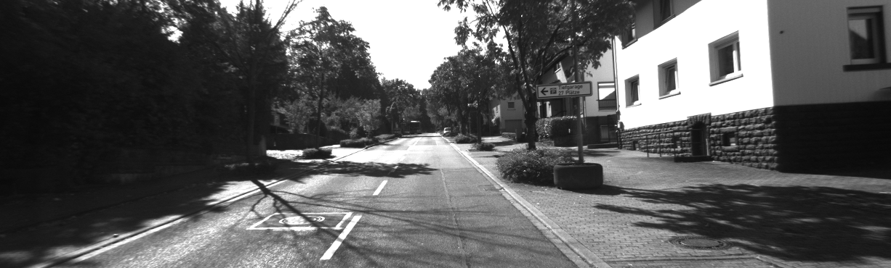
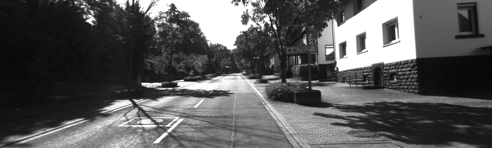
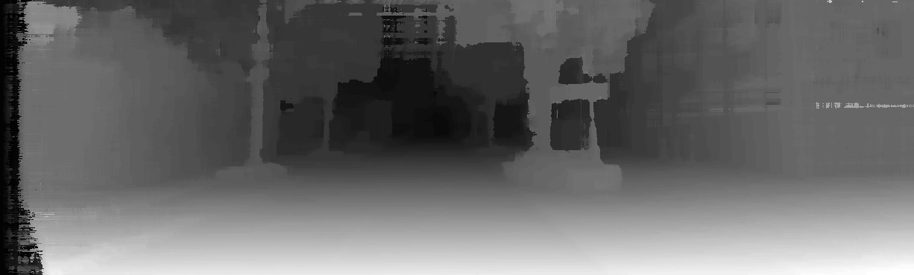
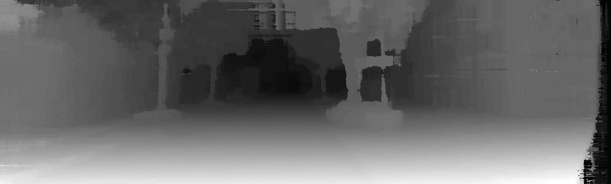
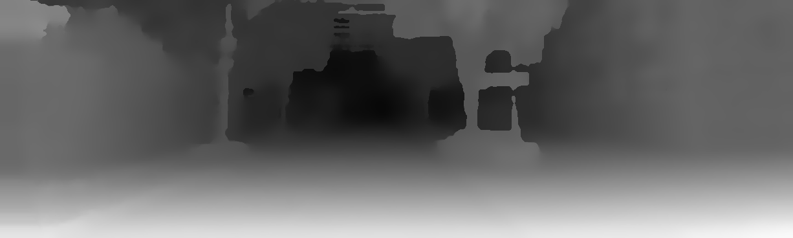
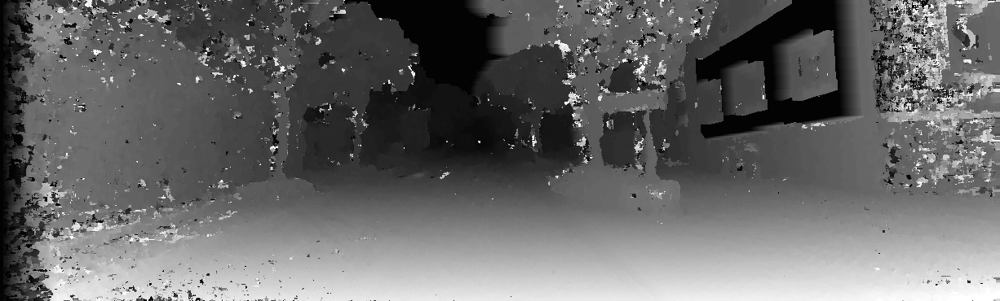
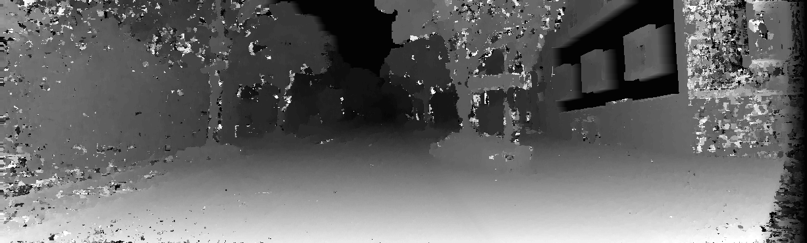

Stereo Matching by Training a Convolutional Neural Network to Compare Image Patches
===================================================================================

The repository contains

- procedures to compute the stereo matching cost with a convolutional neural network;
- procedures to train a convolutional neural network on the stereo matching task; and
- a basic stereo method (cross-based cost aggregation, semiglobal matching,
  left-right consistency check, median filter, and bilateral filter); 

A NVIDIA GPU with at least 6 GB of memory is required to run on the KITTI
data set and 12 GB to run on the Middlebury data set. We tested the code on GTX
Titan (KITTI only), K80, and GTX Titan X. 
The code is released under the BSD 2-Clause license.
Please cite our [paper](http://arxiv.org/abs/1510.05970)
if you use code from this repository in your work.

	@article{zbontar2016stereo,
	  title={Stereo matching by training a convolutional neural network to compare image patches},
	  author={Zbontar, Jure and LeCun, Yann},
	  journal={Journal of Machine Learning Research},
	  volume={17},
	  pages={1--32},
	  year={2016}
	}

Download trained networks
-------------------------

- [KITTI 2012 fast](https://s3.amazonaws.com/mc-cnn/net_kitti_fast_-a_train_all.t7)
- [KITTI 2012 accurate](https://s3.amazonaws.com/mc-cnn/net_kitti_slow_-a_train_all.t7)
- [KITTI 2015 fast](https://s3.amazonaws.com/mc-cnn/net_kitti2015_fast_-a_train_all.t7)
- [KITTI 2015 accurate](https://s3.amazonaws.com/mc-cnn/net_kitti2015_slow_-a_train_all.t7)
- [Middlebury fast](https://s3.amazonaws.com/mc-cnn/net_mb_fast_-a_train_all.t7)
- [Middlebury accurate](https://s3.amazonaws.com/mc-cnn/net_mb_slow_-a_train_all.t7)

Compute the Matching Cost
-------------------------

Install [Torch](http://torch.ch/), [OpenCV 2.4](http://opencv.org/), and
[png++](http://www.nongnu.org/pngpp/).

Run the following commands in the same directory as this README file.

Compile the shared libraries:

	$ cp Makefile.proto Makefile
	$ make

The command should produce two files: `libadcensus.so` and `libcv.so`.

To run the stereo algorithm on a stereo pair from the KITTI 2012 training set&mdash;

- Left input image  
  
- Right input image  
  

&mdash;download the pretrained network and call `main.lua` with the following arguments:

	$ wget -P net/ https://s3.amazonaws.com/mc-cnn/net_kitti_fast_-a_train_all.t7
	$ ./main.lua kitti fast -a predict -net_fname net/net_kitti_fast_-a_train_all.t7 -left samples/input/kittiL.png -right samples/input/kittiR.png -disp_max 70
	Writing right.bin, 1 x 70 x 370 x 1226
	Writing left.bin, 1 x 70 x 370 x 1226
	Writing disp.bin, 1 x 1 x 370 x 1226

The first two arguments (`kitti fast`) are used to set the default
hyperparameters of the stereo method. The outputs are stored as three binary
files:

- `left.bin`: The matching cost after semiglobal matching and cross-based
  cost aggregation with the left image treated as the reference image.  
  
- `right.bin`: Same as `left.bin`, but with the right image treated as the
  reference image.  
  
- `disp.bin`: The disparity map after the full stereo method.  
  

Use the `bin2png.lua` script to generate the `.png` images like the ones above:

	$ luajit samples/bin2png.lua 
	Writing left.png
	Writing right.png
	Writing disp.png

If you wish to use the raw convolutional neural network outputs, that is,
without applying cross-based cost aggregation and semiglobal matching, run
the following command:

	$ ./main.lua kitti fast -a predict -net_fname net/net_kitti_fast_-a_train_all.t7 -left samples/input/kittiL.png -right samples/input/kittiR.png -disp_max 70 -sm_terminate cnn
	Writing right.bin, 1 x 70 x 370 x 1226
	Writing left.bin, 1 x 70 x 370 x 1226
	Writing disp.bin, 1 x 1 x 370 x 1226

The resulting disparity maps should look like this:

- `left.png`  
  
- `right.png`  
  

Note that `-disp_max 70` is used only as an example. To reproduce our
results on the KITTI data sets use `-disp_max 228`.

See the [predict_kitti.lua](predict_kitti.lua) script for how you might
call `main.lua` in a loop, for multiple image pairs.

### Load the Output Binary Files ###

You can load the binary files (if, for example, you want to apply 
different post-processing steps that you have written yourself) by memory 
mapping them.  We include examples of memory mapping for some of 
the more popular programming languages.

- **Lua**

		require 'torch'
		left = torch.FloatTensor(torch.FloatStorage('../left.bin')):view(1, 70, 370, 1226)
		right = torch.FloatTensor(torch.FloatStorage('../right.bin')):view(1, 70, 370, 1226)
		disp = torch.FloatTensor(torch.FloatStorage('../disp.bin')):view(1, 1, 370, 1226)

- **Python**

		import numpy as np
		left = np.memmap('../left.bin', dtype=np.float32, shape=(1, 70, 370, 1226))
		right = np.memmap('../right.bin', dtype=np.float32, shape=(1, 70, 370, 1226))
		disp = np.memmap('../disp.bin', dtype=np.float32, shape=(1, 1, 370, 1226))

- **Matlab**

		left = memmapfile('../left.bin', 'Format', 'single').Data;
		left = permute(reshape(left, [1226 370 70]), [3 2 1]);
		right = memmapfile('../right.bin', 'Format', 'single').Data;
		right = permute(reshape(right, [1226 370 70]), [3 2 1]);
		disparity = memmapfile('../disp.bin', 'Format', 'single').Data;
		disparity = reshape(disparity, [1226 370])';

- **C**

		#include <fcntl.h>
		#include <stdio.h>
		#include <sys/mman.h>
		#include <sys/stat.h>
		#include <sys/types.h>
		int main(void)
		{
			int fd;
			float *left, *right, *disp;
			fd = open("../left.bin", O_RDONLY);
			left = mmap(NULL, 1 * 70 * 370 * 1226 * sizeof(float), PROT_READ, MAP_SHARED, fd, 0);
			close(fd);
			fd = open("../right.bin", O_RDONLY);
			right = mmap(NULL, 1 * 70 * 370 * 1226 * sizeof(float), PROT_READ, MAP_SHARED, fd, 0);
			close(fd);
			fd = open("../disp.bin", O_RDONLY);
			disp = mmap(NULL, 1 * 1 * 370 * 1226 * sizeof(float), PROT_READ, MAP_SHARED, fd, 0);
			close(fd);
			return 0;
		}

Train
-----

This section explains how to train the convolutional neural network on the
KITTI and Middlebury data sets.

### KITTI ###

Download both

- the [KITTI 2012](http://www.cvlibs.net/download.php?file=data_stereo_flow.zip) data set and unzip it
into `data.kitti/unzip` (you should end up with a file `data.kitti/unzip/training/image_0/000000_10.png`) and 
- the [KITTI 2015](http://www.cvlibs.net/download.php?file=data_scene_flow.zip) data set and unzip it
into `data.kitti2015/unzip` (you should end up with a file `data.kitti2015/unzip/training/image_2/000000_10.png`).

Run the preprocessing script:

	$ ./preprocess_kitti.lua
	dataset 2012
	1
	...
	389
	dataset 2015
	1
	...
	400

Run `main.lua` to train the network:

	$ ./main.lua kitti slow -a train_tr
	kitti slow -a train_tr 
	conv(in=1, out=112, k=3)
	cudnn.ReLU
	conv(in=112, out=112, k=3)
	cudnn.ReLU
	conv(in=112, out=112, k=3)
	cudnn.ReLU
	conv(in=112, out=112, k=3)
	cudnn.ReLU
	nn.Reshape(128x224)
	nn.Linear(224 -> 384)
	cudnn.ReLU
	nn.Linear(384 -> 384)
	cudnn.ReLU
	nn.Linear(384 -> 384)
	cudnn.ReLU
	nn.Linear(384 -> 384)
	cudnn.ReLU
	nn.Linear(384 -> 1)
	cudnn.Sigmoid
	...

The network is trained on a subset of all training examples with the remaining
examples used for validation; to train on all examples use

	$ ./main.lua kitti slow -a train_all

In the previous command, the KITTI 2012 data set is used. If you wish to train
on the KITTI 2015 run

	$ ./main.lua kitti2015 slow -a train_tr

To train the fast architecture instead use

	$ ./main.lua kitti fast -a train_tr

The network is stored in the `net/` directory.

	$ ls net/
	...
	net_kitti2012_fast_-action_train_tr.t7
	...

### Middlebury ###

Run `download_middlebury.sh` to download the training data
(this can take a long time, depending on your internet connection).

	$ ./download_middlebury.sh

The data set is downloaded into the `data.mb/unzip` directory.

Compile the [MiddEval3-SDK](http://vision.middlebury.edu/stereo/submit3/). You
should end up with the `computemask` binary in one of the directories listed in
your `PATH` enviromential variable.  

Install [ImageMagick](http://www.imagemagick.org/script/index.php); the
preprocessing steps requires the `convert` binary to resize the images.

Run the preprocessing script:

	$ mkdir data.mb.imperfect_gray
	$ ./preprocess_mb.py imperfect gray
	Adirondack
	Backpack
	...
	testH/Staircase

The preprocessing is slow (it takes around 30 minutes) the first time it is
run, because the images have to be resized.

Use `main.lua` to train the network:

	$ ./main.lua mb slow -a train_tr

Other Useful Commands
---------------------

Compute the error rate on the validation set (useful for setting hyperparameters):

	$ ./main.lua kitti fast -a test_te -net_fname net/net_kitti_fast_-a_train_tr.t7 
	kitti fast -a test_te -net_fname net/net_kitti_fast_-a_train_tr.t7 
	0.86836290359497        0.0082842716717202
	...
	0.73244595527649        0.024202708004929
	0.72730183601379        0.023603160822285
	0.030291934952454

The validation error rate of the fast architecture on the KITTI 2012 data set is 3.029%.

\***

Compute the error rate on the validation set of one dataset for a network that
has been trained on a different dataset.

	$ ./main.lua kitti fast -a test_te -net_fname net/net_mb_fast_-a_train_all.t7
	kitti fast -a test_te -net_fname net/net_mb_fast_-a_train_all.t7
	2.1474301815033	0.0071447750148986
	...
	1.4276049137115	0.024273838024622
	1.4282908439636	0.01881285579564
	1.408842086792	0.021741689597834
	0.031564540460366

The validation error rate of the fast architecture tested on KITTI 2012 but trained on
Middlebury is 3.156%.

\***

Prepare files for submission to the KITTI and Middlebury evaluation server.

	$ ./main.lua kitti fast -a submit -net_fname net/net_kitti_fast_-a_train_all.t7 
	kitti fast -a submit -net_fname net/net_kitti_fast_-a_train_all.t7 
	  adding: 000038_10.png (deflated 0%)
	  adding: 000124_10.png (deflated 0%)
	  ...
	  adding: 000021_10.png (deflated 0%)

The output is stored in `out/submission.zip` and can be used to submit to the
[KITTI evaluation
server](http://www.cvlibs.net/datasets/kitti/user_submit.php).

\***

Experiment with different network architectures:

	$ ./main.lua kitti slow -a train_tr -l1 2 -fm 128 -l2 3 -nh2 512
	kitti slow -a train_tr -l1 2 -fm 128 -l2 3 -nh2 512 
	conv(in=1, out=128, k=3)
	cudnn.ReLU
	conv(in=128, out=128, k=3)
	cudnn.ReLU
	nn.Reshape(128x256)
	nn.Linear(256 -> 512)
	cudnn.ReLU
	nn.Linear(512 -> 512)
	cudnn.ReLU
	nn.Linear(512 -> 512)
	cudnn.ReLU
	nn.Linear(512 -> 1)
	cudnn.Sigmoid
	...

\***

Measure the runtime on a particular data set:

	$ ./main.lua kitti fast -a time
	kitti fast -a time 
	conv(in=1, out=64, k=3)
	cudnn.ReLU
	conv(in=64, out=64, k=3)
	cudnn.ReLU
	conv(in=64, out=64, k=3)
	cudnn.ReLU
	conv(in=64, out=64, k=3)
	nn.Normalize2
	nn.StereoJoin1
	0.73469495773315

It take 0.73 seconds to run the fast architecure on the KITTI 2012 data set. If
you care only about the time spent in the neural network, you can terminate the
stereo method early:

	$ ./main.lua kitti fast -a time -sm_terminate cnn
	kitti fast -a time -sm_terminate cnn 
	conv(in=1, out=64, k=3)
	cudnn.ReLU
	conv(in=64, out=64, k=3)
	cudnn.ReLU
	conv(in=64, out=64, k=3)
	cudnn.ReLU
	conv(in=64, out=64, k=3)
	nn.Normalize2
	nn.StereoJoin1
	0.31126594543457
